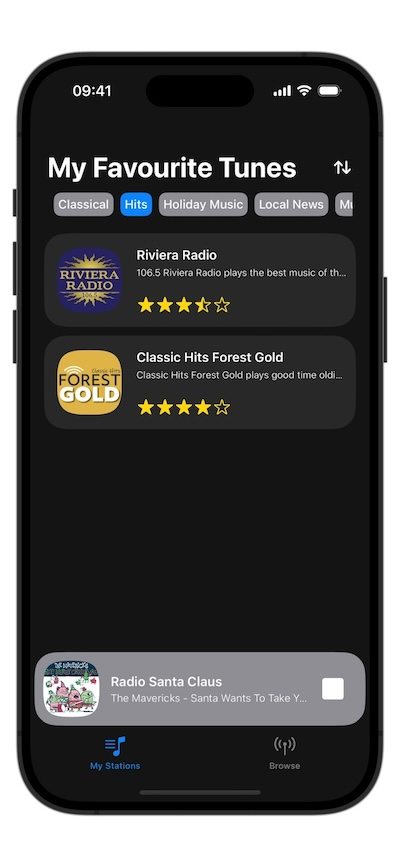
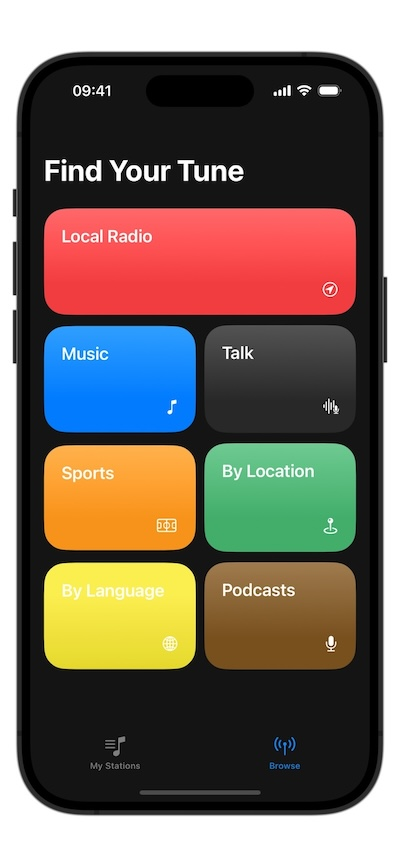
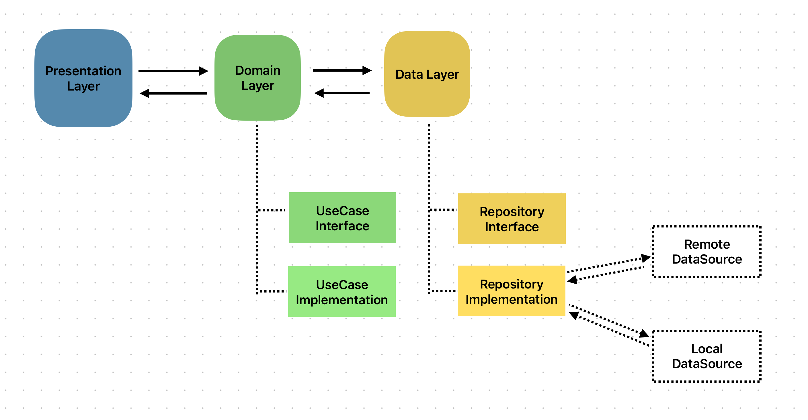
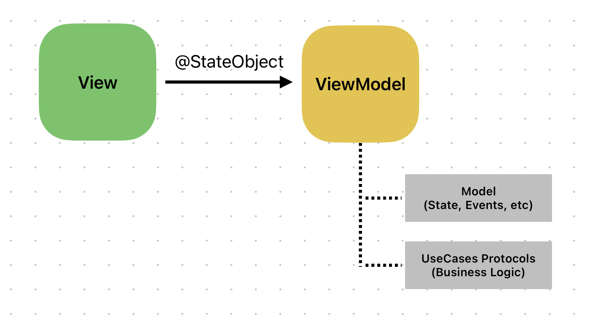
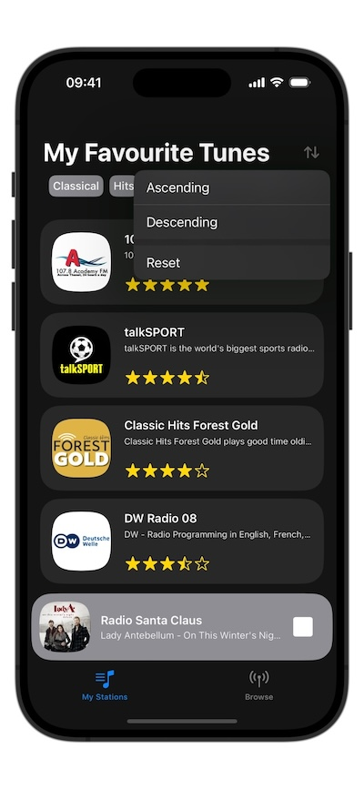
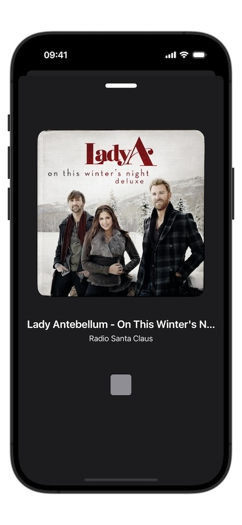
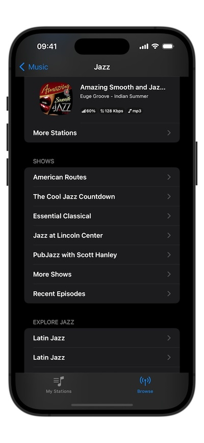
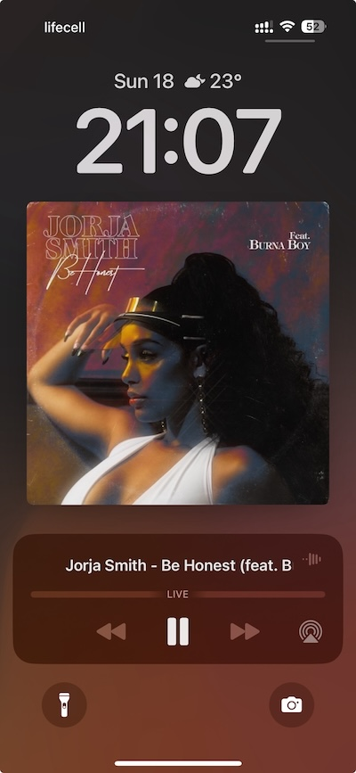
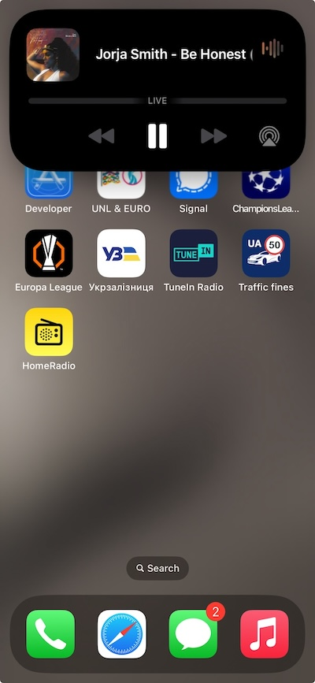

# Home Radio app

## Table of Contents
- [App Overview](#app-overview)
- [Architecture](#architecture)
- [Screens Overview](#screens-overview)
- [Things to Change and Known Bugs](#things-to-change-and-known-bugs)
- [Best Practices](#best-practices)

## App Overview

HomeRadio is a light-weight streaming application, without any 3rd party dependencies, created using:
- Clean Architecture + MVVM,
- Modularization using SPM,
- Swift,
- SwiftUI,
- Combine,
- AVFoundation.

**Summary** of project features: 
- shows radio stations fetched from mini TuneIn station API;
- filtering by radio station tags and sorting by rating;
- browse and navigate the TuneIn library hierarchy;
- play a radio station stream and check its metadata, artwork, title, etc;
- pass metadata info to the Lock screen (Now Playing info).

## Architecture
Working on this project, I thought of the following principles:
- scalability;
- clear separation of concerns;
- maintainability

The project follows **Clean Architecture** principles, ensuring a clear separation of concerns by organizing the codebase into three distinct layers:

1. **Presentation Layer**: Responsible for the user interface and interaction, providing a seamless experience for end-users.
2. **Domain Layer**: Contains the business logic, addressing the product owner’s needs by managing how screen data is built, modified, and processed.
3. **Data Layer**: Handles data fetching and persistence, interacting with remote and local storage through Data Transfer Objects (DTOs).

To further enhance modularity, Swift Package Manager (SPM) was used to implement vertical modularization. Each layer is encapsulated within its respective package:

- **Domain Layer**: depends only on the Data layer, ensuring business logic remains decoupled from external dependencies.
- **Data Layer**: depends solely on Networking and Persistence modules, keeping it focused on data management.

In addition to these core layers, other SPM packages were created for Persistence, RadioPlayer, and Logger functionalities.
This approach resulted in a scalable and maintainable project architecture, with a clear separation of concerns, making the codebase easier to navigate and extend.

MVVM Implementation

The project employs the Model-View-ViewModel (MVVM) architecture to structure the presentation layer. Here’s how it’s implemented:

- **ViewModel as @StateObject**: Each screen’s ViewModel is instantiated as a @StateObject, ensuring that its lifecycle is managed by the View itself.
  This guarantees that the ViewModel persists across view updates and is properly retained.
- **@ObservedObject for Child Views**: When a ViewModel needs to be shared with child views, it is passed down as an @ObservedObject.
  This allows the child views to observe and respond to changes in the ViewModel without affecting its lifecycle.
- **UseCase Integration**: Each ViewModel interacts with UseCases from the Domain layer to retrieve and process data before presenting it
  to the user interface. This ensures that the UI receives data in a format that’s ready for display, keeping the ViewModel focused on UI-related logic.

## Screens Overview
This app works both on iPhone and iPad and also supports light and dark themes.
Minimum iOS version - 16.0.
On the main screen you will find fetched stations from the new Home Task assignment.
You are able to sort them by rating and filter by tags.

If you drag the "NowPlayingSmallView" up you will find the view with an artwork and track title. 
Artwork is fetched using iTunes API.

Since NavigationStack is in charge - it enables us a programmatic navigation, surfing through the huge TuneIn library 
and popping a lot of screens in case of long tap on Back button.

The RadioPlayer service is also fully integrated with NowPlayingCenter:

Error handling and checking for empty stations is also backed by respective Views.

## Things to Change and Known Bugs

- **Refreshing Main Screen**: If you refresh the main screen while stations are sorted or filtered, the list will reset to its initial state. Given more time, I would implement a solution to preserve the sort/filter state during refreshes.
- **Sorting and Filtering Sync**: Currently, sorting and filtering actions are not synchronized, so each action resets the previous one. This needs to be addressed for better user experience.
- **Now Playing Display**: While you can play a radio station from the TuneIn library in the second tab (Browse Categories), it doesn’t appear in the Now Playing section. This should definitely be implemented in a production app.
- **Handling 404 Stations**: I considered handling 404 stations (unavailable stations) but opted not to use a NotificationCenter message for this test project. In a production app, I would ensure the RadioPlayer service passes relevant information on failed stations.
- **Repository Structure**: The current repositories primarily access data from remote sources. In a real-world project, I would introduce separate RemoteDataSource and LocalDataSource classes. The repository would then sync data from both, enabling an offline-first approach where the initial data fetch is from local storage, followed by a remote request to update the local data upon network response.
- **Dependency Injection**: The DI implementation in this test project is quite simple. In a larger project, I would consider using a more robust solution like Needle or Swinject.
- **Testing and Linting**: Adding tests and incorporating a linter would improve the project’s reliability and code quality.
