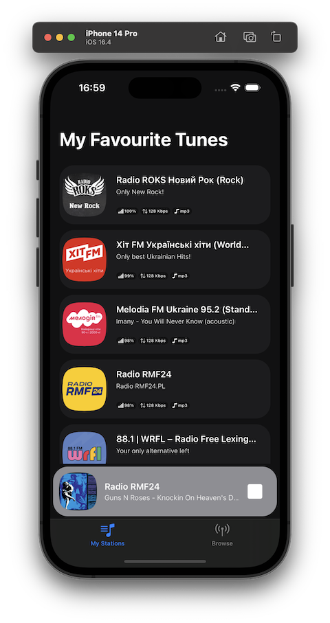
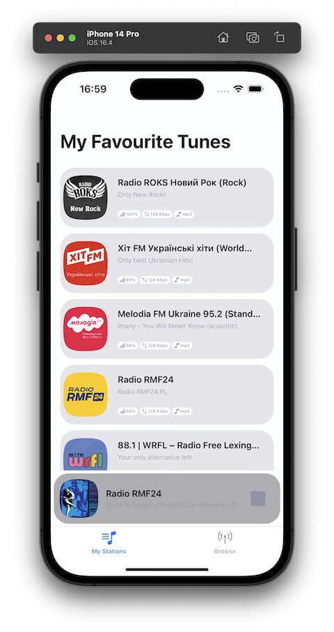
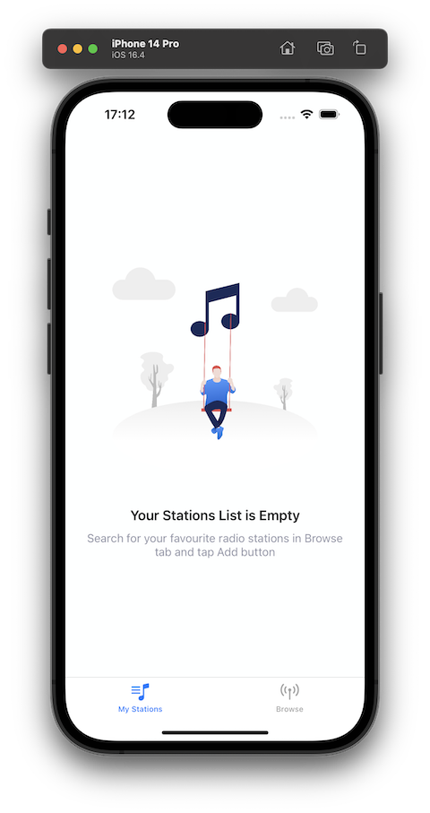
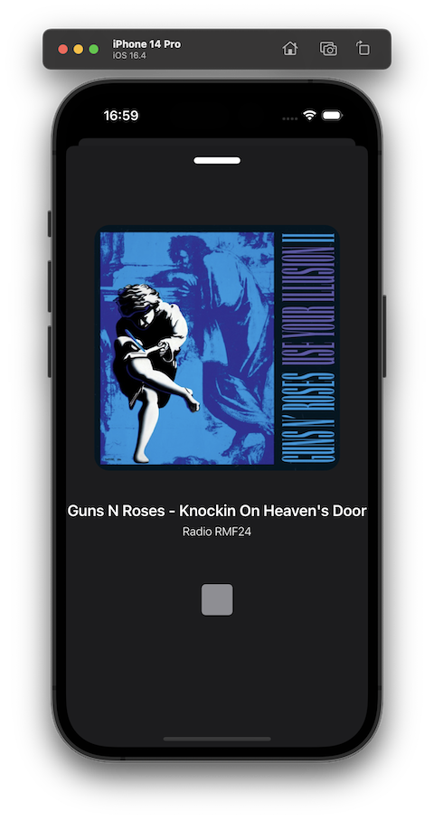
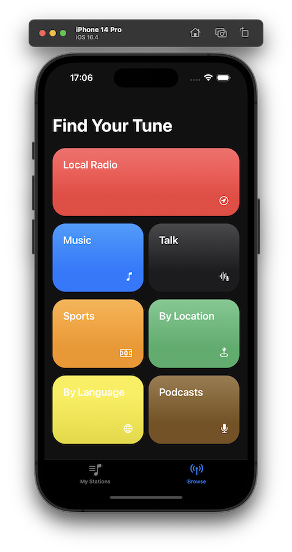
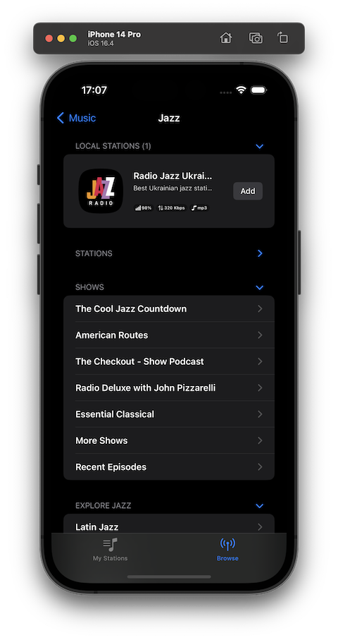
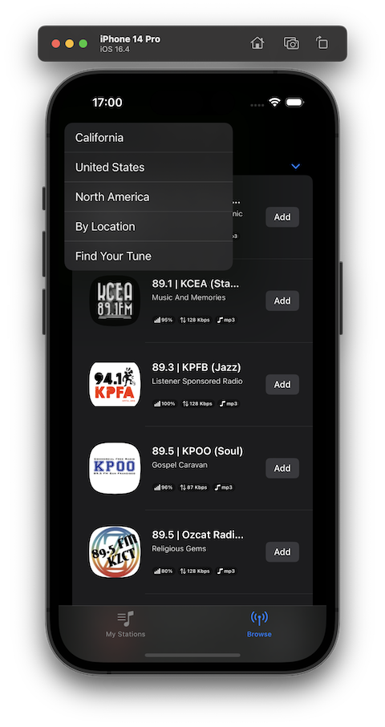
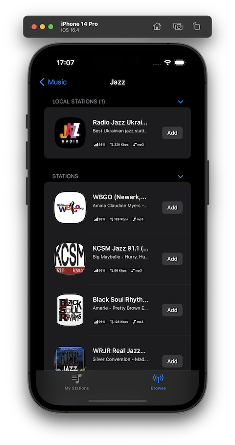
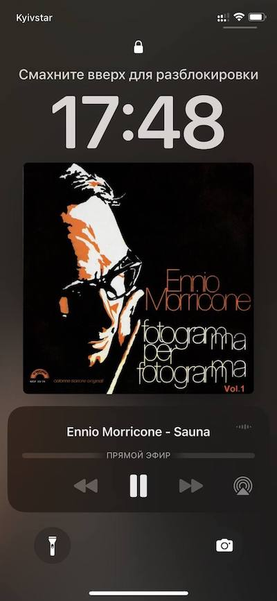

# Home Radio app

## Table of Contents
- [App Overview](#app-overview)
- [Architecture](#architecture)
- [Screens Overview](#screens-overview)
- [Best Practices](#best-practices)

## App Overview
HomeView is a light-weight application, created using Swift and SwiftUI without any 3rd party dependency and serves as an application which can: 
- browse and navigate TuneIn hierarchy;
- save a station to your Favourites list;
- play a station and check its metadata, artwork, title, etc.

## Architecture 
I tried to stick to some simplified version of Clean Architecture by Uncle Bob - Clean Swift with VIP design pattern (View -> Interactor -> Presenter) as the architecture for this project. 

I am not a fan of overengineering, that is why I borrowed only main concepts - separating domain and data layer and also VIP layer. Models in domain layer are our concrete bricks for UI, so we won't have any uncomfortable issues in future when some unapproved changes on back-end appear for example. 

I also really loved the idea of building scalable app using microapps architecture described [here](https://swiftwithmajid.com/2022/01/12/microapps-architecture-in-swift-spm-basics/). 
It's not about main architectural approach of app, but about separating some core services into different modules. I used SPM (Swift Package Manager) for this matter and here is the list of packages:
- RadioPlayer (a service to play a radio station)
- NetworkManager (network layer + helpers + data response models)
- DomainLayer (models for UI)
- Utils (simple DI, Logger, and several Helpers)
All of these modules were developed by myself, so no 3rd party code is used.

The app consists of two tabs in TabView. 
Every screen in the app is a module and we have 3 here:
- MyStations View
- Browse main categories View
- SubCategory View

Each Module consists of 4 files:
- ModuleBuilder - entry point where we can pass some data
- Interactor - the class responsible of events like fetching, saving, downloading etc.
- Presenter - the class responsible for UI updates
- View - swiftUI view itself

## Screens Overview
This app works both on iPhone and iPad, also supports light and dark themes: 

When you first run the app you will see Empty state of the screens shown above:

If you drag the "NowPlayingSmallView" up you will find the view with an artwork and track title. Artwork is fetched using iTunes API.

Navigation is implemented using one SwiftUI view called SubCategoryView.

Since it uses NavigationStack it enables us a programmatic navigation, popping a lot of screens in case of long tap on Back button, etc
Also we my hide unneeded sections.

 

You can add a station to your Favourite station by tapping Add button. It saves into UserDefaults, just for simplicity means.
And of course you may play a radio station from here by tapping on its cell.

The RadioPlayer service also support NowPlayingCenter:

 

All error states are handled with NetworErrorView.

## Best Practices
I've thoroughly checked your TuneIn core values on [Github](https://github.com/tunein/engineering/blob/master/Principles.md) and would like to mention several of your principles I like:
- We decide quickly; we believe perfect is enemy of good - that is why some of UI things are not perfect in this assignment app :)
- We leave code better than when we found it - I refactored a lot while working on this project and also try to stick to this principle on a regular basis.
- Remove things you don't use - I indeed removed a lot of code which appeared to be not useful at all. My only guilty pleasure is using pragma marks :)

And last but not least, the assignment task tells to treat the app like the real one iOS application - that is why I took a little extra-mile adding that functionality for RadioPlayer (iTunes artwork search, saving to fav list, etc)
